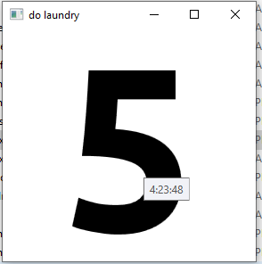

# dtimer

“To achieve great things, two things are needed; a plan, and not quite enough time.” – Leonard Bernstein

Small windows timer used for counting down days to complete tasks.

run command (windowskey+r) and type `dtimer 5` to get a 5 day countdown

`dtimer "do laundry" 5` would give you 5 days to do laundry (should be plenty)

The timer saves data, so running `dtimer` without arguments restores the last used timer if it exists

I typically put it on my second desktop (windowskey+tab, desktop 2) and leave the window open, as i dislike having lots of windows open on my work screen

to install:
paste this into the run command (hotkey is windowskey+r):

`powershell -c "cd $home; wget https://github.com/macromaniac/dtimer/raw/master/dtimer.exe -outfile dtimer.exe;pause"`

alternatively, [dl manually](https://github.com/macromaniac/dtimer/raw/master/dtimer.exe) and paste the exe into %HOMEPATH% (eg C:\Users\/your username/)
