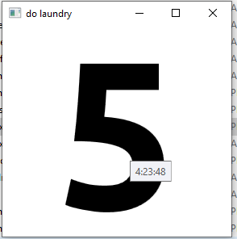

# dtimer

[dl link](https://github.com/macromaniac/dtimer/raw/master/dtimer.exe)

small windows timer i use for counting down days to complete tasks.
`.\dtimer.exe 5` will give you a 5 day countdown

`.\dtimer.exe 'do laundry' 5` would give you 5 days to do laundry (should be plenty):

The timer saves data, so running `.\dtimer.exe` without arguments restores the last used timer.

You can put the exe in your `shell:startup` folder if you want to be reminded when you login to windows

I like to put it into the run folder (hit run command, winkey+r->alt+b, paste exe into there), that way you can call it via run  (winkey+r->`dtimer "do laundry" 5`)
